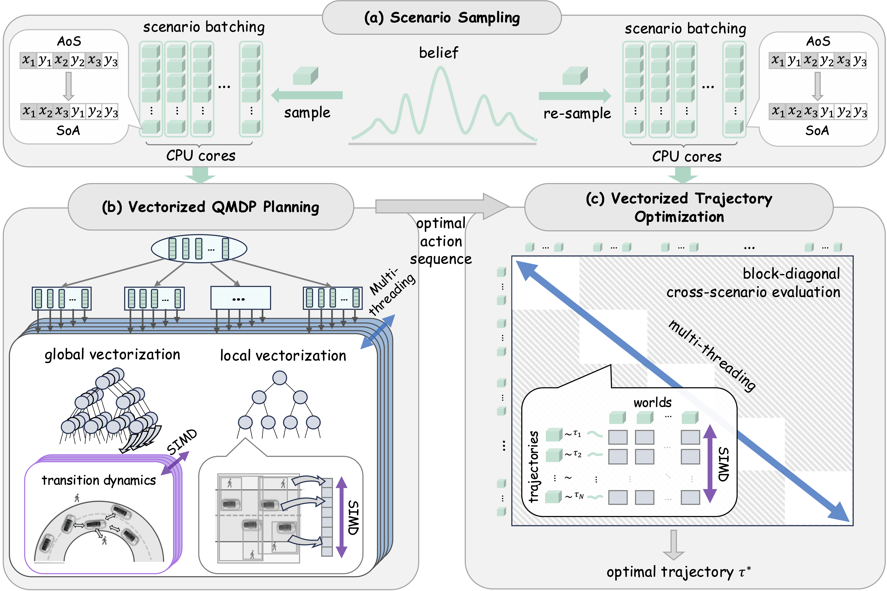

# Vec-QMDP: Vectorized POMDP Planning on CPUs for Real-Time Autonomous Driving

[](https://arxiv.org/pdf/2602.08334)
[](https://sii-boluomonster.github.io/VecQMDP-website)

<div align="center">
  
</div>

## Overview ✨

This repository contains the official implementation of **Vec-QMDP**, a high-performance, CPU-native parallel POMDP planner designed for robust autonomous driving in uncertain environments.

## News 📢

  - **[2026-05]** 🎉 Full codebase released!
  - **[2026-04]** Our paper is accepted by RSS 2026!
  - **[2026-02]** Our paper is available on [arXiv](https://arxiv.org/pdf/2602.08334)!
  - **[2026-02]** Project website is live [here](https://sii-boluomonster.github.io/VecQMDP-website/).

## Abstract

Planning under uncertainty for real-world robotics tasks requires reasoning in enormous high-dimensional belief spaces. **Vec-QMDP** is a CPU-native parallel planner that aligns POMDP search with modern CPUs' SIMD architecture. By adopting **Data-Oriented Design (DOD)** and a **hierarchical parallelism scheme**, Vec-QMDP achieves **227×–1073× speedup** over state-of-the-art serial planners, enabling real-time, high-fidelity planning on standard CPU hardware without the latency overhead of GPU-based solvers.

## Open Source Release Plan 🚀

- [x] **SIMD Vector Interface:** A generic, high-level C++ interface for SIMD-accelerated robotics computations (AVX-512/AVX2).
- [x] **Vectorized POMDP Solver:** The core engine utilizing hierarchical parallelism and DOD-based tree search.
- [x] **Reference Benchmarks:** Full implementations and environment models for
  - [x] **Autonomous Driving:** High-fidelity urban navigation under behavioral uncertainty.
  - [x] **RockSample:** The classic POMDP benchmark optimized for massive vectorized throughput.

## Key Features

  * **SIMD-Accelerated Search:** Fully vectorized tree expansion and belief updates.
  * **Data-Oriented Design (DOD):** Cache-friendly, contiguous memory layouts replacing traditional pointer-based tree structures.
  * **Vectorized Collision Checking:** High-throughput spatial queries via vectorized STR-trees.
  * **Load Balancing:** Optimized UCB-based distribution across multiple CPU cores and SIMD lanes.

## Documentation

Detailed design documents are located in the [`docs/`](docs/) directory:

| Document | Description |
|---|---|
| [`docs/architecture.md`](docs/architecture.md) | Overall system architecture: module layout, build graph, and dependency overview |
| [`docs/vec_qmdp.md`](docs/vec_qmdp.md) | Core search engine design — static vs. dynamic backends, UCB algorithms, and SIMD back-propagation |
| [`docs/tutorial.md`](docs/tutorial.md) | Step-by-step guide for implementing a custom POMDP domain (AoS→SoA transformation, SIMD `stepBatch`, build integration) |
| [`docs/context_qmdp.md`](docs/context_qmdp.md) | Autonomous driving context representation and belief management |
| [`docs/net_belief.md`](docs/net_belief.md) | Neural-network-based belief representation (`NetBelief`) |
| [`docs/qmdp_trajectory_planner.md`](docs/qmdp_trajectory_planner.md) | Top-level QMDP trajectory planner interface |
| [`docs/trajectory_optimization.md`](docs/trajectory_optimization.md) | Vectorized trajectory proposal generation and LQR tracking |
| [`docs/reward_function.md`](docs/reward_function.md) | Reward function design for the autonomous driving domain |
| [`docs/state.md`](docs/state.md) | Ego and agent state representations |
| [`docs/STRtree.md`](docs/STRtree.md) | Vectorized STR-tree spatial index for high-throughput collision checking |
| [`docs/utils.md`](docs/utils.md) | Shared utilities: SIMD helpers, math functions, map utilities, and parameter loading |

## Getting Started

### Prerequisites

| Requirement | Version | Notes |
|---|---|---|
| OS | Linux (Ubuntu 20.04/22.04) or macOS | — |
| Compiler | GCC ≥ 9 or Clang ≥ 10 | C++17 support required |
| CMake | ≥ 3.15 | Included in `requirements.txt`; `pip install cmake` is used if not on system |
| Eigen3 | ≥ 3.4 | `conda install -c conda-forge eigen` |
| Python | 3.9 | Boost.Python must match this version |
| Boost | ≥ 1.74 | `sudo apt-get install -y libboost-all-dev` |
| OpenGL | — | Headless servers only: `sudo apt-get install -y libgl1-mesa-glx` |
| CUDA | 12.4 | Required for torch 2.6.0 GPU acceleration |
| CPU | AVX2 | Intel Haswell / AMD Zen 1 or later |

### Installation

**1. Set up the nuPlan dataset**

Follow the [official nuPlan dataset setup guide](https://nuplan-devkit.readthedocs.io/en/latest/dataset_setup.html) to download and configure the dataset. After downloading, organize your data according to the following structure.

```plaintext
$HOME/nuplan/
|-- dataset
|   |-- maps
|   |   |-- nuplan-maps-v1.0.json
|   |   |-- sg-one-north
|   |   |-- us-ma-boston
|   |   |-- us-nv-las-vegas-strip
|   |   `-- us-pa-pittsburgh-hazelwood
|   `-- nuplan-v1.1
|       `-- trainval           # Dataset files (.db)
`-- exp
    `-- simulation       # Directory for simulation results
```

**2. Create the conda environment**

```bash
conda create -n vec_qmdp python=3.9
conda activate vec_qmdp
```

**3. Install nuplan-devkit**

```bash
cd $HOME
git clone https://github.com/motional/nuplan-devkit.git && cd nuplan-devkit
pip install -e .
```

**4. Clone and install Vec-QMDP**

```bash
cd $HOME
git clone https://github.com/SII-BoluoMonster/VecQMDP.git && cd VecQMDP
```

Install system-level and conda dependencies before the Python packages:

```bash
# Boost (with Python/NumPy) and OpenGL runtime
sudo apt-get install -y libboost-all-dev libgl1-mesa-glx

# Eigen3 into the conda environment (auto-detected via $CONDA_PREFIX)
conda install -c conda-forge eigen
```

Install Python dependencies:

```bash
pip install -r requirements.txt
```

`requirements.txt` notes:
- **PyG wheels** (`torch-cluster`, `torch-scatter`) are fetched for torch 2.6.0+cu124. If you use a different PyTorch or CUDA version, update the `--find-links` URL (see [PyG installation guide](https://pytorch-geometric.readthedocs.io/en/latest/install/installation.html)).
- **`setuptools<81`** is pinned to avoid a `UserWarning` from `lightning_fabric`. Do not upgrade setuptools beyond this bound.

Apply a one-time patch to fix `bokeh` compatibility with NumPy 2.x (`np.bool8` was removed in NumPy 1.24):

```bash
sed -i 's/bokeh_bool_types += (np.bool8,)/bokeh_bool_types += (np.bool_,)/' \
  "$(python -c 'import site; print(site.getsitepackages()[0])')/bokeh/core/property/primitive.py"
```

**5. Install the QCNet predictor**

```bash
cd python_planner/qcpredictor
pip install -e .
cd ../..
```

---

### Run Closed-loop Evaluation on nuPlan

Two evaluation settings are provided, each on a dedicated Git branch:

| Setting | Branch | Description |
|---|---|---|
| **Non-Reactive (NR)** | `main` | Other agents follow fixed log replay |
| **Reactive (R)** | `reactive` | Other agents respond to the ego vehicle's behavior |

**1. Configure environment variables**

Add the following to your `~/.bashrc` (or set them for your current session):

```bash
export NUPLAN_DATA_ROOT="$HOME/nuplan/dataset"
export NUPLAN_MAPS_ROOT="$HOME/nuplan/dataset/maps"
export NUPLAN_EXP_ROOT="$HOME/nuplan/exp"
export NUPLAN_HYDRA_CONFIG_PATH="$HOME/nuplan-devkit/nuplan/planning/script/config"
export NUPLAN_DEVKIT_ROOT="$HOME/nuplan-devkit"
export NUPLAN_MAP_VERSION="nuplan-maps-v1.0"

export PYTHONPATH="$HOME/VecQMDP/python_planner/qcpredictor:$HOME/nuplan-devkit:$HOME/VecQMDP/python_planner:$HOME/VecQMDP"
```

**2. Build the GEOS static library (first-time setup)**

The C++ collision module requires a statically linked GEOS library built with AVX support. This only needs to be done once:

```bash
cd external/geos
bash geos_with_simd.sh
cd ../..
```

**3. Configure planning time and parallelism**

The tree search budget is controlled by `MAX_PLANNING_TIME` (in `include/utils/params.hpp`) together with `NUM_THREADS` and `NUM_SCENARIOS_PER_THREAD` (must be a multiple of 8). Use the following recommended settings per split and evaluation mode, then rebuild the shared library to apply any changes.

| Branch | Split | `MAX_PLANNING_TIME` | `NUM_THREADS` | `NUM_SCENARIOS_PER_THREAD` |
|---|---|---|---|---|
| `main` (NR) | `val14_split` | `8.0f` | 8 | 8 |
| `main` (NR) | `test_hard` | `8.0f` | 8 | 8 |
| `main` (NR) | `test14_random` | `0.5f` | 8 | 8 |
| `reactive` (R) | all splits | `8.0f` | 8 | 8 |

**4. Build the Vec-QMDP shared library**

The build must be run inside the `vec_qmdp` conda environment. Do **not** define `ENABLE_HOMOGENOUS_SEARCH` for nuPlan evaluation — the heterogeneous search mode is required for belief diversity across independent scenarios.

```bash
conda activate vec_qmdp

# Display all available build options
bash scripts/build_vec_qmdp.sh -h

# Standard release build (recommended)
bash scripts/build_vec_qmdp.sh --opt=O3
```

**5. Run closed-loop evaluation**

```bash
python scripts/simulation/sim_planner.py [--split SPLIT] [--challenge CHALLENGE] [--worker WORKER]
```

| Argument | Default | Choices | Description |
|---|---|---|---|
| `--split` | `val14_split` | `val14_split`, `test_hard`, `test14_random` | Scenario split to evaluate |
| `--challenge` | `closed_loop_nonreactive_agents` | `closed_loop_nonreactive_agents`, `closed_loop_reactive_agents` | Simulation mode |
| `--worker` | `ray_distributed` | `ray_distributed`, `sequential` | Worker backend (`sequential` recommended for debugging) |

**Non-Reactive examples** (`main` branch):

```bash
# val14 -- sequential worker (for debugging)
python scripts/simulation/sim_planner.py \
    --split val14_split \
    --challenge closed_loop_nonreactive_agents \
    --worker sequential

# Hard test scenarios -- distributed Ray
python scripts/simulation/sim_planner.py \
    --split test_hard \
    --challenge closed_loop_nonreactive_agents \
    --worker ray_distributed
```

**Reactive examples** (`reactive` branch):

Switch to the `reactive` branch before building and running:

```bash
git checkout reactive
bash scripts/build_vec_qmdp.sh --opt=O3

python scripts/simulation/sim_planner.py \
    --split val14_split \
    --challenge closed_loop_reactive_agents \
    --worker ray_distributed
```

---

### Run the RockSample Benchmark

The Rock Sample POMDP is a self-contained benchmark included in `examples/rock_sample/` that requires no external datasets. It serves as a useful entry point for understanding the VecQMDP search engine independent of the autonomous driving stack.

**1. Build the VecQMDP executable**

RockSample uses the homogenous search mode — all scenarios share the same grid topology, so a single shared tree path gives higher throughput. Before building, uncomment `#define ENABLE_HOMOGENOUS_SEARCH` in `include/planning/vec_qmdp_dynamic.hpp` (dynamic backend) or `include/planning/vec_qmdp_static.hpp` (static backend).

```bash
# Default: Dynamic DynVecQMDP backend (recommended for large action/depth spaces)
bash examples/rock_sample/build_vec_qmdp.sh

# Use the Static VecQMDP backend (faster for shallow trees where A^H < ~100,000)
bash examples/rock_sample/build_vec_qmdp.sh --static-solver

# Additional options: --clean (remove build dir before building), --debug (Debug mode)
bash examples/rock_sample/build_vec_qmdp.sh --clean --opt=O3
```

**2. Build the DESPOT baseline executable**

```bash
# Standard release build
bash examples/rock_sample/build_despot.sh

# Additional options
bash examples/rock_sample/build_despot.sh --clean --jobs 8
bash examples/rock_sample/build_despot.sh --debug    # Debug mode
bash examples/rock_sample/build_despot.sh --no-simd  # Disable SIMD
```

After a successful build the binaries are placed under `build/bin/`:
- `build/bin/Vec-QMDP_rock_sample` — DESPOT solver (used by `run_despot.sh`)

**3. Run the benchmark**

The benchmark scripts in `examples/rock_sample/benchmark/` run 20 simulations with fixed rock configurations and compare VecQMDP against DESPOT.

```bash
# Run VecQMDP over 20 simulations (logs saved to examples/rock_sample/benchmark/logs/)
bash examples/rock_sample/benchmark/run_vecqmdp.sh

# Run DESPOT over 20 simulations
bash examples/rock_sample/benchmark/run_despot.sh

# Analyze and compare results
python3 examples/rock_sample/benchmark/analyze.py
```

## Citation

If you find our work or code useful, please cite our paper:

```bibtex
@article{jin2026vecqmdp,
  title={Vec-QMDP: Vectorized POMDP Planning on CPUs for Real-Time Autonomous Driving},
  author={Jin, Xuanjin and Dong, Yanxin and Sun, Bin and Xu, Huan and Hao, Zhihui and Lang, XianPeng and Cai, Panpan},
  journal={arXiv preprint arXiv:2602.08334},
  year={2026}
}
```

## Acknowledgements 🙏

This project is built on top of excellent open-source ecosystems. We sincerely thank the teams behind **[VAMP](https://github.com/kavrakilab/vamp)**, **[x86-simd-sort](https://github.com/numpy/x86-simd-sort)**, **[Highway](https://github.com/google/highway)**, and **[GEOS](https://github.com/libgeos/geos)** for their impactful contributions.